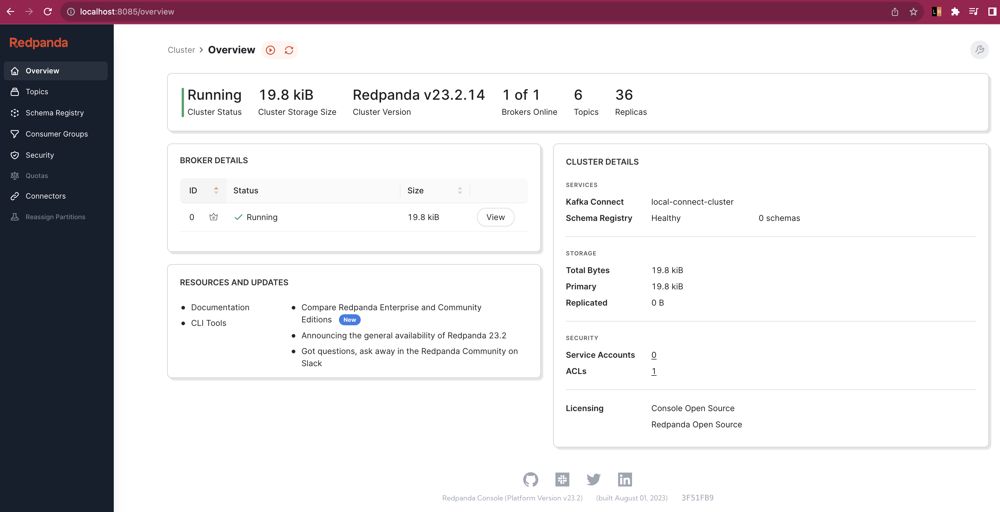

# [Day-1] Introduction to Message Broker

A message broker is a software, that enables services to communicate with each other using messages. As the name implies, a message broker acts as a middleman that shares information between services, even if the services are written in different programming language. Read this [article](https://medium.com/geekculture/streams-vs-pub-sub-systems-in-redis-70626821cc2f) to understand the use-case of message broker. 

Most commons type of message brokers are:
- point-to-point
- publish subscribe

### Point-to-Point

- Messages are put onto a **queue**. Once the messages are arrived, a consumer (that subscribe to a queue) consumes the message, sets acknkowledge status and processes them. The consumed messages will be **deleted** after they are processed. 
- A queue model is also called a **push-based model**. A producer pushes messages to the queues, then the consumers (that listen to the queue) will get the messages.


- An real-world example of this would be queuing at the shops. You stand in one big queue (message queue) with one cashier (consumer), that cashier is processing each shopper (message). Shops open up more cashiers (consumers) to help with the customers (messages). Similar thought process with channels, messages and queues.


- Popular point-to-point message broker tool is RabbitMQ

### Publish/Subscribe
- At a glance it looks similar with queue type, but they are different. A Publish/Subscribe is a messaging model where a message is sent to multiple consumers through a **topic**. The topic is the link between publisher and subscriber. The subscribers may or may not acknowledge the published message, the consumed messages are retained in the topic for some time.

- A publish/subscribe model is also known as **pull-based** model. A pull-based model left the responsibility of fetching messages to consumers. Consumers can decide at which offset (checkpoint) they want to process the message.


- Popular publish-subscribe message broker tool is Apache Kafka.


### What is Stream Processing

In Data Engineering, as we combine multiple services such as: 

Stream processing is the act of processing a continuous flow of incoming data. For example, you are watching the netflix show as the packets arrive, without waiting a whole data are downloaded.

https://towardsdatascience.com/understanding-stream-processing-and-apache-kafka-5610bc2d6fa3


### What is Redpanda?

Throughout this lessons, for the sake of less-complexity and efficient resource, we choose Redpanda over Kafka. Redpanda is a simple, powerful, and cost-efficient streaming data platform that is compatible with Kafka APIs while eliminating Kafka complexity. The difference between Redpanda and Kafka can be read [here](https://docs.redpanda.com/current/get-started/intro-to-events/#redpanda-differentiators).


## Concept of Topic, Partitions and Offset

- https://www.geeksforgeeks.org/topics-partitions-and-offsets-in-apache-kafka/

- https://www.geeksforgeeks.org/how-kafka-producers-message-keys-message-format-and-serializers-work-in-apache-kafka/

- https://www.geeksforgeeks.org/how-kafka-consumer-and-deserializers-work-in-apache-kafka/

### Publisher

### Consumer


## [Hands-On] Implementation of Streaming Data Ingestion without Schema

Let's create a publisher and consumer with python and redpanda. We are going 
- 
- how to see topic in redpanda

```
python -m venv .venv
source .venv/bin/activate
pip install confluent_kafka
```


### Spin up docker

```
docker-compose -f kafka/docker-compose.yml up
```

- if the port is conflict, change the host port to `8085`

```
    ports:
      - 8085:8080
```

- access redpanda via browser




[ASK: perlu gak ya?]

## Improvement on Streaming Data Ingestion Using Avro Schema

Records in a topic are just arrays of bytes. Kafka broker doesn’t care about the type of data we’re sending. To make those byte arrays useful in our applications, producers and consumers must know how to interpret them.

- https://codingharbour.com/apache-kafka/why-use-avro-data-format-with-apache-kafka
- https://towardsdatascience.com/using-kafka-with-avro-in-python-da85b3e0f966
- https://levelup.gitconnected.com/kafka-schema-registry-b5eb8afac228

### Avro Schema

- what is avro schema : https://www.tutorialspoint.com/avro/avro_schemas.htm

- Define avro schema for our streaming data [here](./kafka/avro/schema/stocks_schema.avsc)

```

```


## [TASK] Create topic, publisher and consumer


## Reference

- https://tsh.io/blog/message-broker/
- https://serverlessland.com/event-driven-architecture/visuals/queues-vs-streams-vs-pubsub