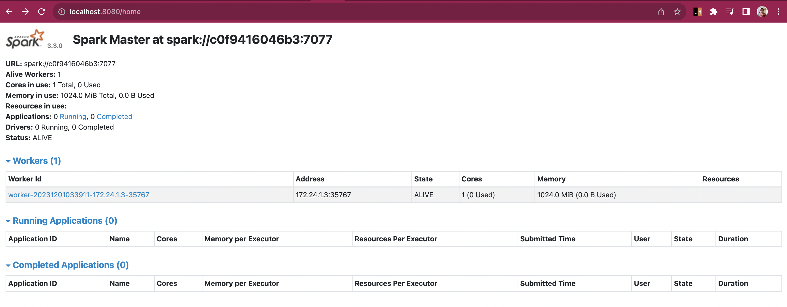

# [Day-4] Streaming Data with Apache Spark

## What is Apache Spark? 

Apache Spark is a data processing framework that can quickly perform processing tasks on very large data sets, and can also distribute data processing tasks across a distributed system.  It provides high-level APIs in Java, Scala, Python and R, and an optimized engine that supports general execution graphs.

PySpark is a high-level API that is provided by Apache Spark. PySpark combines Python’s learnability and ease of use with the power of Apache Spark to enable processing and analysis of data at any size for everyone familiar with Python. PySpark can be used to perform common data analysis tasks, such as filtering, aggregation, and transformation of large datasets on a distributed system.

In the previous material, we learned Pandas to transform the dataset. So, what makes PySpark different from Pandas? 

There is a difference in their execution and processing architecture. PySpark enables us to perform real-time, large-scale data processing in a distributed environment using Python. 

## [Hands-On] Implementation of Streaming Data Ingestion with PySpark 

### 1. Spin up redpanda and spark with docker-compose

- The full docker-compose file can be seen [here](./docker/spark/docker-compose.yml)

```
docker-compose -f docker/spark/docker-compose.yml up
```

- There will be 3 dashboards are running: 
    - Redpanda dashboard: http://localhost:8085 
    - Spark Master dashboard: http://localhost:8080

    

    - Spark Worker dashboard: http://localhost:8081

### 3. Create Publisher

- Read the full code [here](./pyspark/produce/produce.py).

- This is a different approach to publish data to a topic. Previous publish data example [here](./pubsub/json/produce.py)) used the `confluent_kafka` library.

- The code below, is pretty self-explanatory, will publish stock data to kafka topic named `stock_json_topic_spark` using library `kafka`. 

```
def get_json_data():

    stock = {
        'event_time': datetime.now().isoformat(),
        'ticker': random.choice(['AAPL', 'AMZN', 'MSFT', 'INTC', 'TBV']),
        'price': round(random.random() * 100, 2)
    }
    return json.dumps(stock) 

def main():
    producer = KafkaProducer(bootstrap_servers=['localhost:19092'])

    for _ in range(20000):
        json_data = get_json_data()
        producer.send("stock_json_topic_spark", bytes(f'{json_data}','UTF-8'))
        print(f"Data is sent: {json_data}")
        time.sleep(1)

```

- Run the publisher code with this command

```
python pyspark/produce/produce.py
```

### 4. Create Consumer with PySpark

- Install PySpark locally with this command:

```
python -m venv .venv
source .venv/bin/activate
pip install pyspark
```


- The consumer full code can be seen [here](./pyspark/consume/consume.py)

- To run the spark, we urge you to use docker, but if it is not possible, please install spark on your laptop by following the guide [here](https://kontext.tech/article/560/apache-spark-301-installation-on-linux-guide) for windows and ubuntu users.

- For mac users, in the main project directory, please download spark and extract the file. 
```
wget https://dlcdn.apache.org/spark/spark-3.3.3/spark-3.3.3-bin-hadoop3.tgz
tar -xzvf spark-3.3.3-bin-hadoop3.tgz
```

- We should use the `spark-submit` command to run the PySpark code, instead of using Python command.

```
spark-3.3.3-bin-hadoop3/bin/spark-submit --packages "org.apache.spark:spark-sql-kafka-0-10_2.12:3.3.0" pyspark/consume/consume.py

```

- `--packages` is used to import an external module and is not available to Spark applications by default. `kafka` is an external module. 

- Let's dive to each part of the [consume.py code](./pyspark/consume/consume.py)

- We define a SparkSession as an entry point to PySpark. This way, we can utilize the Spark high-level API, RDD and DataFrame.

```
spark_session = SparkSession\
    .builder\
    .appName("RedpandaSparkStream")\
    .getOrCreate()

```

- To read the stock data stream, we use `readStream` method. This method is used to read the stream data incrementally. The older stream data will not be read, instead Spark reads the newly added data since last read operation.

```
stream = spark_session\
    .readStream\
    .format("kafka")\
    .option("kafka.bootstrap.servers", "localhost:19092")\
    .option("subscribe", "stock_json_topic_spark")\
    .option("startingOffsets", "earliest")\
    .load()
```

- Define the log level of Spark, only the `WARN` log level will be shown in console.

```
spark_session.sparkContext.setLogLevel('WARN')
```

- Print the schema of the stream.

```
stream.printSchema()

```


- Remember that kafka store the data in a byte format, so we need to parse value from binay to string. `selectExpr()` transforms, executes an SQL expression and returns a new updated DataFrame.

```
json_df = stream.selectExpr("cast(value as string) as value")
```

- Prepare a schema for the data stream, we need to deserialize it with a valid schema.

```
json_schema = StructType([
    StructField('event_time', StringType(), True), \
    StructField('ticker', StringType(), True), \
    StructField('price', DoubleType(), True) \
])
```


- Convert the string `value` (on column `value`) to a struct based on predefined schema.

```
# Apply Schema to JSON value column and expand the value
json_expanded_df = json_df.withColumn("value", from_json(json_df["value"], json_schema)).select("value.*") 

json_expanded_df.printSchema()
```


- We use `writeStream.format("console")`` to write the streaming DataFrame to console. 


```
query = json_expanded_df \
    .writeStream \
    .format("console") \
    .start()

query.awaitTermination()

```

- The definition of awaitTermination can be read [here](https://spark.apache.org/docs/3.1.1/api/python/reference/api/pyspark.sql.streaming.StreamingQuery.awaitTermination.html)

- Side by side, the streaming publisher and the consumer result can be seen in this video

- Apache Spark compatibility in cloud: 
    - AWS: Glue
    - GCP: Dataproc

# Resources:
- https://medium.com/geekculture/pandas-vs-pyspark-fe110c266e5c
- https://redpanda.com/blog/buildling-streaming-application-docker-spark-redpanda 
- https://subhamkharwal.medium.com/pyspark-structured-streaming-read-from-kafka-64c40767155f